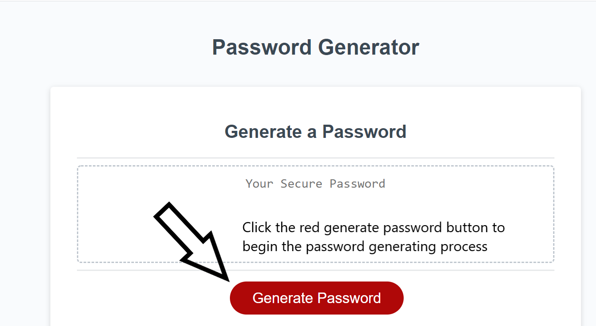
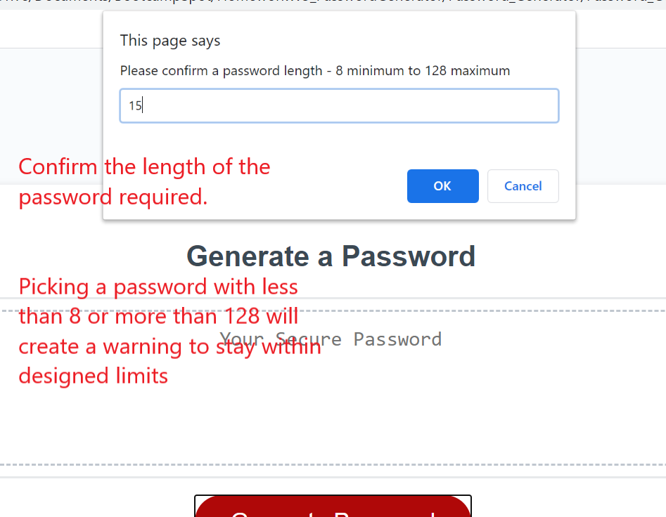
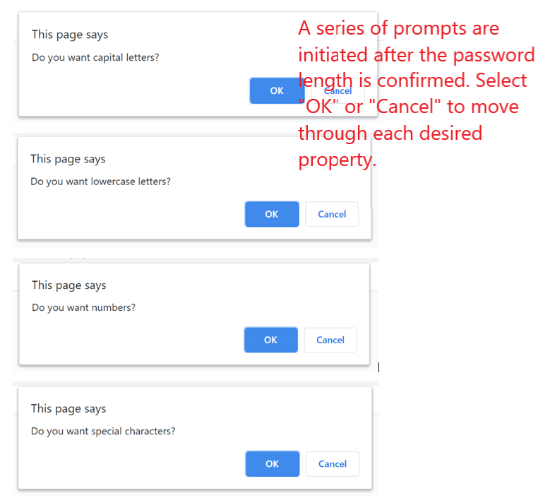
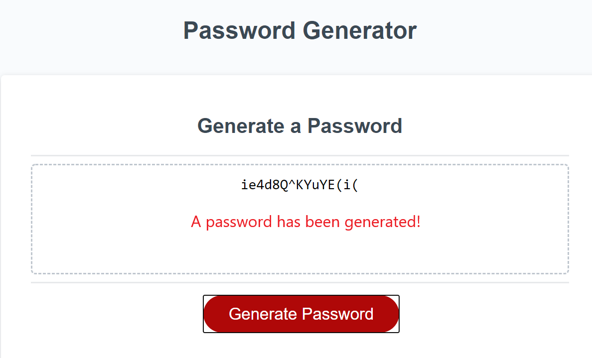

# Password_Generator

## Link to Deployed Application: https://msnow-21.github.io/Password_Generator/

## Technologies Used: HTML, CSS, and JavaScript

Usage: The Password Generator is an application that generates a password by clicking a “Generate Password” button and answering a password length prompt. After a length is determined, the user is then asked through prompts whether they would like Capital Letters, Lower Case Letters, Numbers, or Special Characters in their password.

First part of the user process. Clicking the generate password button.

Second part of the user process. Determining the password length.

Third part of process. Answering a series of prompts to determine if the user wants upper case letters, lower case letters, numbers, or special characters.

Viewing the generated password.

Description:
The Password Generator is a program that utilizes arrays of upper-case letters, lower case letters, numbers, and special characters to create a password based on the password length and the chosen characters by the user. The password generator accepts a user password length of min 8 characters to a total of 128 characters. The length is then stored in a variable for use in the for loops. There are four for loops to meet the possible confirmation of each character variable. As a character is selected at true, for example, the capital letter confirmation is confirmed, the for loop for that runs. The for loop then has to capture the random variables at the given length of the user password. The random characters on then pushed into a new defined array. The new array then goes through another for loop to capture all the selected variables and defined length. This new variable for the array of random characters is the password result for the function.

Challenges:
There were multiple challenges that had to be met through testing each process as the program was entered in. The biggest challenge was understanding how to use the for loop to capture the selected length of the password and then determining how to define and get that result to a place where it could be used. Another challenge was trying to determine if multiple if and else statements were needed to capture the combinations of user confirmations. The thought of using concatenated arrays also came up based on user confirmations.

